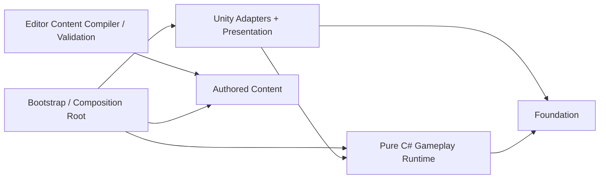

# Babel 核心架构重构计划

> 状态：实施中（WP1 已完成；WP0、WP2、WP3、WP4 仍有未完成项；尚未达到全量 Definition of Done）<br>
> 计划版本：1.3<br>
> 更新日期：2026-08-03<br>
> 适用工程：`Babel_Client/`（Unity 2022.3 LTS，以 `ProjectVersion.txt` 为准）

## 1. 结论与已确认决策

本次重构采用以下总体方案：

- 模块化单体，不拆成多个独立服务。
- 数据驱动配置，CSV 保留为策划源数据，运行时使用校验、编译后的只读目录。
- 所有核心玩法由一个 60 Hz 固定步长模拟循环驱动。
- 输入通过 Command 进入模拟，模块间副作用通过有序 Buffer 和 Domain Event 传递。
- 核心 Runtime 使用纯 C#，Unity `MonoBehaviour` 只负责装配、输入采集和表现同步。
- 删除 QFramework，不引入 VContainer 或其他重量级框架，使用手写 `GameCompositionRoot` 完成依赖装配。
- 敌人使用真正的对象池；模拟实体与 GameObject View 解耦。
- 在独立重构分支内一次完成，允许分工作包推进，但最终只在全部验收通过后合并；合并版本不保留新旧两套并行架构。
- 允许重新绑定现有 Scene、Prefab 和序列化引用，不要求旧 `MonoBehaviour` 字段兼容。

### 1.1 本期范围

- 工程目录和 asmdef 重组。
- 中央模拟循环与 Run 生命周期。
- Runtime / View 分层。
- RunFlow、GodCasting、Humans、Navigation、Abilities、Combat、Babel、Progression、Encounter 模块化。
- QFramework 完整移除及轻量替代。
- 真对象池。
- 内容编译、引用清单和编辑器校验。
- 美术、音频、Prefab 和源数据目录整理。
- EditMode、PlayMode、性能与长稳测试。

### 1.2 本期不做

- 不迁移 Unity Input System，继续使用现有输入方式，由输入适配器隔离。
- 不引入 Addressables。
- 不切换 URP。
- 不引入 Jobs、Burst 或 DOTS。
- 不实现完整 Replay。
- 不实现完整局内存档恢复。

## 2. 当前问题与目标方案

| 当前问题 | 影响 | 重构方案 |
| --- | --- | --- |
| `UIGamePanel` 推进倒计时 | HUD 成为游戏规则的时间权威 | 倒计时归 `RunSimulation`；HUD 只读取 `RunReadModel` |
| 敌人、技能、UI 各自在 `Update` 中推进玩法 | 调用顺序不稳定，暂停和倍速难统一 | 统一由 `RunDriver` 驱动 60 Hz `RunSimulation.Step()` |
| `Global`、`GameSession`、`StatsTracker` 和多个静态事件保存局内状态 | 生命周期不清、测试隔离困难 | 局内状态进入 `RunContext`；跨帧展示通过 ReadModel，局内消息通过 Buffer |
| 多处直接写 `Time.timeScale` | 升级界面关闭后可能丢失 2x/4x 倍速 | `RunClock` 是速度和暂停的唯一业务权威；可选表现层适配器是唯一允许写 `Time.timeScale` 的对象 |
| `Enemy.Update` 同时处理移动、能力、受击反馈和死亡 | 单类职责过重，难以批量优化 | 敌人变成纯数据实体；脑、移动、能力、战斗、死亡分别由系统处理 |
| 伤害效果直接 `Physics2D` 查询并调用 `TakeDamage` | 规则与 Unity 物理强耦合 | Unity 查询只产生命中结果；伤害进入 `DamageBuffer`，由 Combat 结算 |
| 技能升级只替换 `Skill.Config` | Trigger/Effect 仍可能使用旧冷却和伤害 | 技能实例保存等级状态；每次执行从只读目录取当前定义，或升级时原子重建运行时组件 |
| `TransientEnemyPool` 实际是 `Resources.Load + Instantiate/Destroy` | 生成抖动、GC 和资源路径耦合 | `GameObjectPool` 预热、复用、重置；Prefab 由 Manifest 直接引用 |
| `MAX_ENEMIES = 100` 硬编码 | 内容规模被代码常量限制 | 容量进入池配置；可扩容并告警，不以硬编码静默拒绝正常生成 |
| 单一 `Babel.asmdef` 且依赖 QFramework | 依赖边界无法约束 | 拆分 Foundation、Gameplay、Unity、Bootstrap、Editor 和 Tests asmdef |
| `Resources`、硬编码路径和运行时加载混用 | 重命名或移动资源易失效 | `GameContentManifest` 持有显式资源引用，构建前统一校验 |
| 塔层数和场景结构隐含在对象命名中 | 内容修改容易破坏运行时假设 | `BabelAuthoring` 显式绑定实际层、建造点和入口；按场景内容编译，不强制十层 |

## 3. 目标分层与依赖方向



依赖规则：

1. `Foundation` 不依赖 Gameplay 和 UnityEngine。
2. `Gameplay` 只依赖 `Foundation`，不得引用 UnityEngine、Prefab、Sprite、Animator 或 Physics2D。
3. `Unity` 可以依赖 `Gameplay` 和 `Foundation`，负责输入、场景、对象池、视图和音频。
4. `Bootstrap` 负责创建依赖和控制生命周期，业务模块不得反向获取全局容器。
5. `Editor` 只提供导入、编译和校验工具，不进入 Player 运行时代码。

### 3.1 asmdef 现状与边界

下列 8 个目标 asmdef 已在 `Assets/Babel/` 下落地，不再只是规划项。QFramework/UIKit 程序集和代码引用已经物理删除并由自动门禁保护；旧 `Babel` 玩法程序集仍要保留到纯 C# Gameplay 与 View 完成原子切换，因此“8 个目标 asmdef 已建立”仍不等于旧玩法程序集已经全部删除。

| asmdef | 职责 | 主要依赖 |
| --- | --- | --- |
| `Babel.Foundation` | 基础值类型、集合、随机数接口、事件和生命周期工具 | 无 |
| `Babel.Gameplay` | 全部纯 C# 局内规则与模块 | `Babel.Foundation` |
| `Babel.Unity` | Unity 适配器、View、Presenter、对象池和内容引用 | Foundation、Gameplay、Unity 包 |
| `Babel.Bootstrap` | ProjectRoot、SceneFlow、RunRoot、CompositionRoot | Foundation、Gameplay、Unity |
| `Babel.Editor` | CSV 编译、资源和场景校验 | 上述运行时程序集，仅 Editor |
| `Babel.Tests.Unit` | 无 UnityEngine 的纯逻辑测试 | Foundation、Gameplay |
| `Babel.Tests.Editor` | 内容编译、Manifest、Scene 和 Build Gate 测试 | Editor、Unity、Bootstrap |
| `Babel.Tests.PlayMode` | 场景、View、池和 UI 集成测试 | Bootstrap、Unity、Gameplay |

## 4. 目标工程目录

```text
Babel_Client/Assets/
  Babel/
    Bootstrap/
      Runtime/
    Foundation/
      Runtime/
    Gameplay/
      Runtime/
        RunFlow/
        GodCasting/
        Humans/
        Navigation/
        Abilities/
        Combat/
        Babel/
        Progression/
        Encounter/
    Unity/
      Runtime/
        Infrastructure/
          Content/
          Input/
          Pooling/
          SceneFlow/
          Time/
        Presentation/
          Humans/
          Babel/
          Abilities/
          UI/
    Editor/
      Content/
      Validation/
    Content/
      Data/
        Enemies/
        Skills/
        Waves/
      Definitions/
      Manifests/
      Generated/
    Art/
      Humans/
        Sprites/
        Animations/
        Controllers/
        Materials/
      Babel/
        Sprites/
        Pieces/
        Materials/
      Environment/
        Backgrounds/
        Maps/
        Props/
      Abilities/
        Icons/
        Sprites/
        VFX/
      UI/
        Common/
        MainMenu/
        Gameplay/
        Upgrade/
        Results/
        Icons/
        Fonts/
      VFX/
        Textures/
        Materials/
        Shaders/
        ParticleAssets/
      Atlases/
        Humans/
        Babel/
        Abilities/
        UI/
    Audio/
      Music/
      SFX/
      Mixers/
    Prefabs/
      Humans/
      Babel/
      Abilities/
      VFX/
      UI/
      Debug/
    Scenes/
      Boot/
      Menu/
      Game/
    Tests/
      EditMode/
      Editor/
      PlayMode/
  ThirdParty/
```

### 4.1 美术资源边界

- `Art/` 只放 Unity 最终导入的视觉资产：PNG、Sprite、AnimationClip、AnimatorController、Material、Shader、粒子配置和图集。
- `Prefabs/` 单独存放代码与美术组合后的可实例化对象；Prefab 不放进 `Art/`。
- `Content/` 存放 CSV、ScriptableObject 定义、Manifest 和编译产物，不存放纯视觉文件。
- `Unity/Presentation/` 只放 C# 表现代码，不放图片或 Prefab。
- 音频统一进入 `Audio/`，不混在 `Art/`。
- 外部插件进入 `Assets/ThirdParty/`；项目代码不得散落在插件目录中。
- PSD、Aseprite、Blender、高分辨率原稿等源文件放在 Unity `Assets` 之外的仓库根目录 `ArtSource/`；只有导出版本进入 `Assets/Babel/Art/`。

资源按“游戏领域”优先分类，而不是只按文件格式分类。例如技能图标归入 `Art/Abilities/Icons`，塔的材质归入 `Art/Babel/Materials`。只有真正跨领域复用的内容才进入 `UI/Common` 或对应共享目录。

### 4.2 现有美术资源迁移表

| 现有路径 | 目标路径 | 处理说明 |
| --- | --- | --- |
| `Assets/Art/Sprite` | `Assets/Babel/Art/Humans/Sprites` | 当前为 Worker 图片，按人类单位归类 |
| `Assets/Art/Animation/Worker` | `Assets/Babel/Art/Humans/Animations/Worker` 与 `Controllers/Worker` | Clip 与 Controller 分开 |
| `Assets/Art/Tower/Pieces` | `Assets/Babel/Art/Babel/Pieces` | 保留现有六层素材含义，不假设固定十层 |
| `Assets/Art/Tower` 其他文件 | `Assets/Babel/Art/Babel` 或 `Content/Definitions` | 图片归美术；`tower_manifest.json` 评估后转内容定义 |
| `Assets/Art/Map` | `Assets/Babel/Art/Environment/Maps` | 地图和背景按环境归类 |
| `Assets/Art/Icons` | `Assets/Babel/Art/Abilities/Icons` | 当前均为技能图标 |
| `Assets/Art/Particles` | `Assets/Babel/Art/VFX/ParticleAssets` | 粒子配置与贴图、材质分目录 |
| `Assets/Art/UI` | `Assets/Babel/Art/UI` | 按 MainMenu、Gameplay、Upgrade、Results 再拆分 |
| `Assets/Art/UIPrefab` | `Assets/Babel/Prefabs/UI` | Prefab 从 Art 中移出 |
| `Assets/Art/Perfabs/BuildPoint.prefab` | `Assets/Babel/Prefabs/Babel/BuildPoint.prefab` | 修正 `Perfabs` 拼写并归塔领域 |
| `Assets/Resources/Fonts` | `Assets/Babel/Art/UI/Fonts` | 通过 Manifest/序列化字段引用，不再依赖 Resources |
| `Assets/Resources/Enemies` | `Assets/Babel/Prefabs/Humans` | 接入对象池和 View Catalog |
| `Assets/Resources/Art/UI` | `Assets/Babel/Art/UI` | 与现有 `Assets/Art/UI` 比对后只保留一份权威资产 |
| `Assets/Data` | `Assets/Babel/Content/Data` | CSV 作为策划源数据保留 |

迁移规则：

1. 必须在 Unity 内移动资源，或确保资源和同名 `.meta` 一起移动，以保留 GUID。
2. 重复 UI 资源先比较 GUID、内容和引用关系，确定权威文件并完成重绑后再删除副本。
3. 每批移动后立即运行 Missing Reference、Prefab、Scene 和 Content Manifest 校验。
4. 资源迁移与业务代码迁移分批提交，便于定位序列化引用问题；最终仍只在整体验收后合并。
5. 最终 Player 运行时不得依赖 `Resources.Load` 或硬编码 AssetDatabase 路径。

## 5. 中央模拟循环

### 5.1 时钟模型

- 固定模拟频率：60 Hz，`FixedDelta = 1 / 60` 秒。
- 人类 AI 决策和 HUD ReadModel 发布频率：10 Hz，即每 6 个模拟 Tick 一次。
- `RunDriver` 使用 `unscaledDeltaTime × RunClock.Speed` 累积时间。
- 支持暂停、1x、2x、4x。
- 单渲染帧最多补算 12 个 Tick；超过时记录告警并按既定策略截断积压，防止死亡螺旋。
- 核心 Runtime 不读取或写入 `Time.timeScale`。如动画表现确需同步，只有一个 `PresentationTimeScaleAdapter` 可以写入，并在退出 Run 时恢复为 1。

### 5.2 每帧与每 Tick 顺序

`RunControlCommandQueue` 每个渲染帧都处理，即使 Run 已暂停，以保证继续、调速、重开和退出仍然有效。

每个模拟 Tick 固定按以下顺序执行：

1. 消费 `GameplayCommandBuffer`：点击、选技能、释放主动能力等。
2. 更新计时器、冷却、持续状态。
3. 每 6 Tick 执行一次 Human Brain 决策。
4. 处理导航、移动和工作意图。
5. 处理单位能力和玩家技能触发。
6. 汇总并结算 `DamageBuffer`。
7. 结算死亡、移除和 `DeathRewardBuffer`。
8. 结算 `BuildWorkBuffer` 与塔进度。
9. 发放信仰、升级和技能选择。
10. 更新 Encounter、波次和生成请求。
11. 计算 Run 胜负规则和阶段切换。
12. 发布本 Tick 的延迟 Domain Event 和表现事件；每 6 Tick 更新一次版本化 ReadModel。

所有跨系统结构变化都延迟到对应 Buffer 的结算点，系统遍历期间不得直接增删同一集合。

### 5.3 同 Tick 规则

- 若同一 Tick 内塔完成且倒计时归零，优先判定塔完成，玩家失败。
- 死亡必须先于建造结算：`BuildWorkBuffer` 结算时再次校验来源实体的 generation 和存活状态，本 Tick 已死亡单位不能再提交建造工作。
- 奖励必须来自确认后的死亡记录，避免多次击杀或多次发放信仰。
- 新生成单位从下一 Tick 开始参与 AI、移动和战斗。

## 6. Runtime 核心对象

| 类型 | 职责 |
| --- | --- |
| `EntityHandle(index, generation)` | 稳定标识模拟实体，防止池化后引用到旧实体 |
| `RunPhase` | Booting、Playing、Paused、ChoosingUpgrade、Won、Lost、Disposed |
| `RunClock` | Tick、剩余时间、暂停和倍速的唯一业务状态 |
| `RunContext` | 持有本局所有 Runtime 状态、目录、随机源和 Buffer |
| `RunSimulation` | 按固定顺序执行系统，不包含 Unity API |
| `RunControlCommandQueue` | 暂停、继续、调速、重开、退出等控制命令 |
| `GameplayCommandBuffer` | 从输入和 UI 进入下一 Tick 的玩法命令 |
| `RunEventBuffer` | 延迟分发的类型化局内事件 |
| `DamageBuffer` | 汇总伤害，统一排序和结算 |
| `DeathRewardBuffer` | 汇总确认死亡后的奖励 |
| `BuildWorkBuffer` | 汇总人类单位提交的建造工作 |
| `RunReadModel` | HUD 和界面读取的不可变快照，带 `Version` |

随机数统一从 Run seed 创建的 `IRandomSource` 获取。Gameplay 中禁止调用 `UnityEngine.Random`，以便测试复现和未来扩展 Replay。

## 7. Gameplay 模块职责

| 模块 | 负责 | 不负责 |
| --- | --- | --- |
| RunFlow | RunPhase、时钟、暂停倍速、胜负和退出 | HUD 绘制、场景加载 |
| GodCasting | 点击攻击、主动施法命令和目标解析 | 直接播放特效 |
| Humans | 人类实体数据、职业状态、AI 决策 | GameObject 生命周期 |
| Navigation | 路线、移动、目标点和到达判定 | Transform 插值 |
| Abilities | 触发、冷却、效果描述和状态 Buff | Physics2D 与粒子 |
| Combat | 命中结果、伤害、治疗、生命和死亡确认 | 受击闪烁、飘字 |
| Babel | 层、建造点、施工工作和塔完成 | 场景 Sprite 切换 |
| Progression | 信仰、等级、三选一、技能等级 | 升级 UI |
| Encounter | 波次、生成节奏、单位类型和生成请求 | Instantiate/Destroy |

### 7.1 建造规则保留项

本次重构以当前实现为准，不改成文档草案中的“单人预约 + 连续逐 Tick 贡献”：

- 同一未完成建造点允许多名 Builder 同时选择，不做独占预约。
- Builder 等待自身 `BuildTime` 后，一次性提交 `buildAbility` 进度块。
- 成功提交后消耗一次 `BuildCharges`。
- 如果等待期间建造点被其他单位完成，则重新选点且不消耗次数。
- 默认 Builder 随机选择未完成点；Scout 优先 Gateway。
- 塔的层数取自 `BabelAuthoring` 实际绑定内容；当前场景六层可以继续工作，不写死十层。

实施时同步修订 `docs/gdd/塔建造系统.md`，消除 GDD 与已确认玩法之间的冲突。

## 8. 内容编译与资源引用

### 8.1 数据流程

```text
CSV / Authoring Assets
        ↓ Editor ContentCompiler
Schema、ID、跨表引用、数值范围、Prefab 映射校验
        ↓
Generated Catalog Assets
        ↓ Bootstrap
Immutable Runtime Catalogs + Unity View Catalog
```

- 保留 `enemies.csv`、`skills.csv`、`waves.csv` 的当前字段合同。
- 技能定义继续以 `(skillId, level)` 为唯一键。
- `GameContentManifest` 直接引用源 CSV、编译目录、敌人 Prefab、技能图标、字体、UI View、VFX 和池配置。
- `ContentCompiler` 在 Editor 中生成可进入 Player 的目录资产；Runtime 不按字符串路径读取源文件。
- 普通项目校验只报告缺失或过期的编译产物，不隐式改写资产。
- Build Preprocessor 先重编译 canonical Manifest 内容，再执行完整校验；编译或校验错误阻止构建，警告必须可定位到文件、行和字段。
- `BabelAuthoring` 显式绑定层顺序、各层建造点、Gateway 和视图资源，编译为 Runtime 定义。

### 8.2 必须校验的内容

- ID 非空且唯一，枚举和值类型可解析。
- 所有数值有限且处于允许范围，冷却和 BuildTime 不得为负。
- Wave 引用的 enemyId 必须存在。
- 技能等级连续，Trigger、Effect 及其参数合法。
- 每个可生成单位都有 Prefab/View 映射和池配置。
- Scene 中层顺序、BuildPoint、Gateway 和必要 UI 引用完整。
- Manifest 中不存在 Missing、Resources 路径依赖或 Editor-only 对象。

## 9. Unity 装配、View 与 UI

### 9.1 生命周期

- `Boot` 场景只创建一个 `ProjectRoot`，它是唯一的 `DontDestroyOnLoad` 根对象。
- `ProjectRoot` 持有 `SceneFlowService`、项目设置和 `GameContentManifest`。
- `Menu` 场景显示主菜单。
- `Game` 场景创建 `RunRoot` 和手写 `GameCompositionRoot`；离开场景时完整 Dispose 本局对象。
- 胜负结果作为 `Game` 场景内 Overlay 展示；重开通过 SceneFlow 重新加载 `Game`，不复用旧 `RunContext`。

VContainer 是第三方依赖注入和生命周期容器。本项目当前模块规模不需要它：构造函数注入、明确工厂和一个手写 Composition Root 已足够，并且更便于看清调用顺序。只有未来 Composition Root 明显失控、出现大量作用域对象和自动注册需求时，才重新评估引入容器。

### 9.2 View 同步

- 模拟创建实体后发布 Spawn 表现事件，View Registry 从池获取对应 GameObject 并绑定 `EntityHandle`。
- Transform、Animator、Sprite、特效和音频只消费模拟快照或表现事件。
- View 可以在渲染帧间插值，但不得反向修改 Gameplay 状态。
- 敌人 GameObject 不运行独立玩法 `Update`；批量 View 同步由一个 Presenter/Registry 完成。
- Despawn 必须解绑实体、停止动画和粒子、清空临时状态，再归还对象池。

### 9.3 QFramework 替换表

| QFramework 能力 | 替换方案 |
| --- | --- |
| `ViewController` | 普通 `MonoBehaviour` View 或纯 C# Runtime 对象 |
| UIKit / `UIPanel` | 场景级 `ScreenRouter` + MonoBehaviour View + 纯 C# Presenter |
| `BindableProperty` | Gameplay 使用普通状态；HUD 使用 `RunReadModel + Version` |
| 项目设置的少量响应值 | 最小 `ObservableValue<T>`，相同值不通知，订阅返回 `IDisposable` |
| 生命周期订阅 | `SubscriptionBag` 在 `OnDisable`/Dispose 时统一清理 |
| ActionKit `OnUpdate` | `RunDriver` 或对应 Presenter 的集中更新 |
| `DestroyGameObjGracefully` | 对象池 Despawn；非池对象使用 `Object.Destroy` |
| 自动生成 `.Designer.cs` | 显式 `[SerializeField]` 字段并重新绑定 Prefab/Scene |

只有 Menu、设置等项目级界面可以使用 `ObservableValue<T>`；局内高频状态不得改成响应式属性网络。

## 10. 对象池设计

- `GameObjectPool` 按 View/Prefab ID 建池，由 `PoolConfig` 定义预热量、期望容量和扩容策略。
- Encounter 只产生 Spawn Request，不接触 Prefab。
- Unity Spawn Adapter 从池取 View，并为 Runtime 返回的 `EntityHandle` 建立映射。
- 池耗尽时允许按配置扩容并记录诊断，不使用固定 `MAX_ENEMIES` 截断玩法。
- 所有池对象实现统一 Reset 合同；测试覆盖二次取出时无旧目标、旧血条、旧 Buff、旧协程和旧粒子。
- 稳态运行不得出现敌人 `Instantiate/Destroy`，也不得通过 `Resources.Load` 获取 Prefab。

## 11. 实施工作包

### 11.1 当前实施快照（2026-08-03）

| 工作包 | 当前状态 | 已落地 | 尚未完成 |
| --- | --- | --- | --- |
| WP0 | 进行中，测试与构建基线已完成 | 已记录重构前 EditMode 基线；最终 Windows Development Build 成功并完成 D3D11 启动烟雾 | 100 单位帧时间、GC、Instantiate/Destroy 性能基线尚未记录，因此 WP0 退出条件仍未全部满足 |
| WP1 | 已完成 | `Foundation`、RunFlow/Clock/Driver、Bootstrap/SceneFlow、Manifest 链路和 8 个目标 asmdef 已建立 | Legacy Adapter 的最终删除属于 WP4 原子切换，不反向改变 WP1 已完成状态 |
| WP2 | 进行中 | 纯 C# `GameWorld` 垂直切片已覆盖实体存储、Brain/Build Intent、Combat/Death、Babel、Progression、Encounter/Spawn 及有序 Buffer/Event | 确定性位置/导航、完整 Abilities 与 Input/Skill Command、旧玩法等价迁移及从 Seed 完整跑到胜负仍需收口 |
| WP3 | 进行中 | 真对象池、`EntityViewRegistry`、`ScreenRouter`、MainMenu、HUD、Upgrade、Win/Lose Overlay、正式 Scene/Prefab 重绑和 QFramework/UIKit 物理删除已落地 | 批量 Human View Presenter、位置快照和完整玩法表现尚未接入 |
| WP4 | 部分完成 | CSV/Art/Prefab/Scene 已按领域迁移；ContentCompiler、Manifest、生成资产新鲜度、Build Gate、六层 BabelAuthoring、建造 GDD、资源/包清理与 Windows Build 已落地 | 旧 `Scripts`/静态所有权/Legacy Adapter 仍需随完整 Gameplay/View 原子切换删除 |

当前实现应按以下边界理解：

- WP0 已完成测试和 Windows 构建基线，但在 100 单位性能/GC 基线有可复查记录前仍不能标记为完成。
- WP1 已完成；不能因为 WP2/WP3 仍在迁移而把 WP1 回退为“进行中”。
- WP2 当前是可独立测试的纯 C# `GameWorld` 垂直切片，不是完整旧玩法等价迁移。
- `RunRoot` 仍故意不给 `GameCompositionRoot` 传入 RuntimeContent：主 GameScene 同时保留旧 `EnemyGenerator`、`Enemy.Update`、`TowerManager`、`XpSystem` 和 `LegacyRunBridge`，现在启用新 World 会造成双模拟。
- WP3 的 UI 子阶段已经完成；整个 WP3 仍缺确定性位置快照、批量 Human View Presenter 和完整可视化接入。
- WP4 已完成主要内容/资源迁移、QFramework/UIKit 物理清除和构建能力，但旧玩法架构仍未完成原子切换。

### 11.2 当前测试与构建记录

以下结果来自当前最终文件状态，用于证明已落地切片；它们不替代性能、长稳和完整人工一局验收：

| 范围 | 结果 | 说明 |
| --- | --- | --- |
| WP0 EditMode 基线 | 97 个用例：91 通过、6 失败 | 来自 18 个测试文件；6 个失败均为重构前既有 UI 用例 |
| `Babel.Tests.Unit` | 63/63 通过 | 最终 Job `afb4b1c52c334ac2922019507fa87102`；覆盖 RunFlow、GameWorld、事件、实体 generation 和系统规则 |
| `Babel.Tests.Editor` | 13/13 通过 | 最终 Job `d4b0c926a34f4df6b630f9781c22604a`；新增 no-QFramework、序列化残留、Missing Script/Prefab 门禁，并覆盖 ContentCompiler、BabelAuthoring、生成资产和项目校验 |
| 旧 `Babel.EditModeTests` | 109/109 通过 | 最终 Job `6d4c6c4f3bdf4e87af6233d71b1d3735`；重构前 6 个 UI 失败已随显式 Prefab/Screen 生命周期迁移修复 |
| `Babel.Tests.PlayMode` | 18/18 通过 | 最终 Job `ee08b159024a4a7cb04b3069e612db4d`；覆盖 RunFlow、对象池、Registry 和 ScreenRouter |
| MainMenu / Game UI 定向 | 4/4、20/20、SkillCooldown 4/4、GameEndLifecycle 9/9 | 覆盖显式场景装配、Router 生命周期、按钮 one-shot、HUD 与结算流程 |
| Canonical 内容编译 | 成功 | Hash `9a948f53be151c3c4eae27fe6936657e9e075c81b8f792a54d486e0b70ab93a3`；6 人类、8 波次、9 技能等级、19 XP 阈值、6 层塔 |
| 项目校验 | 0 error / 6 warning | 两条提示 Worker/Scout 仍含旧 `Enemy`；四条提示 elite/priest/engineer/zealot 使用 Worker fallback，均属于尚未原子切换的 Human View 阶段 |
| Windows Development Build | 成功，约 140.01 MB | 最终 Job `build-189323baca`，0 error / 6 个已知迁移 warning；`Builds/Windows/Babel.exe` D3D11 隐藏启动 12 秒且日志 0 条异常命中，随后由烟雾测试主动结束；较清理前约 149.8 MB 减少约 9.8 MB |

### 11.3 明确未完成项

- 尚未把全部 Gameplay 规则等价迁入纯 C# `GameWorld`；尤其缺确定性 SpawnPoint/Position/Navigation、完整 Abilities 与 Gameplay Input/Skill Command。
- 新 World 目前未接入主 GameScene，这是避免新旧权威同时运行的主动保护；最终切换必须与旧 `EnemyGenerator`、`Enemy.Update`、`TowerManager`、`XpSystem`、`LegacyRunBridge` 同批完成。
- `EntityViewRegistry`、事件和对象池基础设施已完成，但批量 Human View Presenter、位置 snapshot、纯表现 Prefab 和完整 View 同步尚未完成。
- QFramework、QFrameworkData、`Global.cs` 和三个 `LegacyUIAuthoring` 场景已经物理删除；两个旧 asmdef 已去除 QFramework/CoreKit/UIKit 引用。`BabelDependencyValidator` 会在项目校验和 Build Preprocessor 中阻止这些依赖、Missing Script 或 Missing Prefab 回流。
- `GameSession`、`StatsTracker`、旧静态事件、旧数据库和旧 `Scripts` 目录尚未完成最终门禁清零；它们仍服务当前主 GameScene，必须与完整 Gameplay/View 切换同批删除，不能先行拆除。
- 尚未完成 100 单位性能/GC 基线、30 分钟 Soak、稳态 0 B GC/无 Instantiate-Destroy 证明，以及人工完成一局/重开/返回菜单验收。
- 因此第 13 节 Definition of Done 当前明确为“未完成”，任何阶段性全绿均不得解释为整体重构已完成。

### 11.4 本轮清理与防回流门禁

已完成且有引用/重复证据支持的清理：

- 物理删除 `Assets/QFramework`、`Assets/QFrameworkData`、`Assets/Scripts/Global.cs` 和 `Assets/Babel/Scenes/LegacyUIAuthoring`；Legacy authoring 场景删除前已备份到 `Temp/CodexRefactorBackup/LegacyUIAuthoring`，QFramework 与 `Global.cs` 仍可由 Git 恢复。
- 删除卸载后已无引用的 `Assets/Adaptive Performance` 配置，并从 `EditorBuildSettings` 清除其 config object。
- 删除三个空旧目录 `Assets/Editor`、`Assets/Plugins`、`Assets/Scripts/Editor`。
- 删除 8 张 SHA-256 完全相同且 GUID 入站引用为 0 的截图副本；保留 41 张内容不同的验收参考图，未替美术/产品擅自删除备用方案。
- 从 Manifest 移除无项目引用的 Adaptive Performance、Collab Proxy、Visual Scripting、Timeline 和 TextMesh Pro；将 2D/Development feature 大合集收敛为显式的 `com.unity.2d.sprite` 与 `com.unity.test-framework`。
- `BabelDependencyValidator` 现会扫描禁止目录、asmdef、MonoScript、已加载程序集，以及全部 Babel Scene/Prefab 的遗留组件、Missing Script 和 Missing Prefab；项目校验、Editor 测试和构建预处理均已接入。
- 清除 `RunContext` 与 `EnemyDatabase` 中两个只写不读字段；最终 Player 构建不再产生对应 CS0414 warning。

以下内容当前不作为垃圾删除：非重复参考图、MainMenu LegacyAlternates、未来状态/按钮单图、`tower_manifest.json`、目标结构中的空 Environment/Input/VFX 目录，以及仍被主 GameScene 使用的旧 `Scripts`。它们分别需要产品判断或等待完整玩法原子切换。

### WP0：基线与保护网

状态：**进行中，测试与构建基线已完成**。100 单位性能/GC 基线仍待补齐。

1. 创建独立重构分支，记录当前工作区已有改动，禁止误覆盖。
2. 在现有 Unity Test Runner 中执行并记录 EditMode 基线：18 个测试文件共发现 97 个用例。
3. 生成一次 Windows Development Build，并记录当前警告和启动结果。
4. 记录 100 单位场景下帧时间、GC、Instantiate/Destroy 和行为结果。
5. 备份 Scene/Prefab 引用清单、Build Settings、当前 CSV 样本和六层 Babel Authoring 结构。

当前基线记录：18 个测试文件共发现 97 个 EditMode 用例，其中 91 个通过、6 个失败。6 个失败均已归类为重构前既有 UI 用例；当前重构状态下旧 EditMode 已达到 109/109。清理后的 Windows Development Build 已成功生成约 140.01 MB 产物，并通过 D3D11 启动烟雾；WP0 仍缺 100 单位性能/GC 基线。

退出条件：测试、构建和性能基线均有可复查记录；所有当前失败均已区分为既有问题或重构回归风险。

### WP1：目录、Foundation 与 Run 骨架（第一阶段详细项）

状态：**已完成**。以下条目是已落地的第一阶段范围；后续物理删除 Legacy Adapter 和旧目录属于 WP3/WP4 收口。

1. 创建 `Assets/Babel` 目标骨架和 8 个目标 asmdef，不立即批量移动所有资源。
2. 实现 Foundation：`EntityHandle`、`IRandomSource`、Seeded Random、轻量 Buffer、`SubscriptionBag` 和基础断言。
3. 实现 RunFlow：`RunPhase`、`RunClock`、Control Command、Gameplay Command、`RunReadModel` 和 `RunSimulation` 空骨架。
4. 实现 `RunDriver` 固定步长累积器、12 Tick 上限、暂停和 1x/2x/4x。
5. 新增 Boot 场景、`ProjectRoot`、`SceneFlowService`、`RunRoot`、`GameCompositionRoot` 和 Dispose 顺序。
6. 建立 `GameContentManifest` 最小版本，仅接入启动所需场景和内容入口。
7. 将 HUD 倒计时从 `UIGamePanel` 移到 RunClock，制作临时 Presenter 读取 ReadModel。
8. 删除其他对象直接控制暂停/倍速的入口，统一投递 Run Control Command。
9. 补齐纯 C# 测试：固定步长、暂停、倍速、帧抖动、补 Tick 上限、状态转换、同 Tick 胜负优先级和 Dispose。
10. 补齐 PlayMode 烟雾测试：Boot → Menu → Game → Pause/Resume → Result → Restart → Menu。

WP1 允许在重构分支中存在临时 Legacy Adapter 以维持场景可运行，但临时适配器必须标注删除任务，且最终合并前全部移除。

退出条件：

- Run 时间权威已离开 UI，暂停与倍速只有一条命令链。
- 不依赖真实帧率即可重复得到相同 Tick 数和胜负结果。
- 场景切换后旧 Run 已 Dispose，第二局无旧事件订阅或静态状态。
- Foundation 和 Gameplay 骨架不引用 UnityEngine。
- WP1 新增测试全部通过。

### WP2：Gameplay Runtime 迁移

状态：**进行中**。当前仅可宣称“纯 C# `GameWorld` 垂直切片完成”；完整玩法迁移及本工作包退出条件尚未完成。

1. 建立只读内容定义和实体存储。
2. 按固定顺序迁移 Human Brain、Navigation、Abilities、Combat、Death、Babel、Progression、Encounter。
3. 将点击和技能选择改为 Gameplay Command。
4. 将伤害、死亡奖励和建造贡献改为专用 Buffer。
5. 修复技能升级仍使用旧 Trigger/Effect 参数的问题。
6. 保留已确认的多 Builder、BuildTime 块提交、BuildCharges 规则。
7. 清除 Gameplay 中的静态局内状态、Unity 随机数、Physics2D 和逐敌人 Update。

退出条件：核心 Run 可在无 Scene、无 GameObject 的 EditMode 测试中从 Seed 完整模拟到胜或负。

### WP3：Unity View、UI 与对象池迁移

状态：**进行中**。真对象池、`EntityViewRegistry`、`ScreenRouter`、MainMenu、Game HUD、Win/Lose Overlay 与 QFramework/UIKit 物理删除已完成；批量 Human View 接入仍未完成。

1. 建立 Entity/View Registry 和批量 View 同步。
2. 为所有人类单位、技能表现、塔、飘字和 UI 建立 View/Presenter。
3. 实现并压测对象池，替换 `TransientEnemyPool`。
4. 实现 `ScreenRouter`，迁移 Menu、HUD、Upgrade、Win/Lose Overlay。
5. 合并 Designer 字段并重新绑定 Scene/Prefab。
6. 删除 ActionKit、UIKit、ViewController、BindableProperty 和 QFramework 代码引用。

退出条件：完整玩法可视化运行；稳态无敌人 Instantiate/Destroy；所有 UI 生命周期测试通过。

### WP4：内容、美术迁移与最终切换

状态：**部分完成，整体未完成**。主要内容/美术/Prefab/Scene 迁移、内容编译、依赖门禁、Build Gate、无引用包/重复资源清理与 Windows Build 已落地；旧玩法架构删除、性能长稳和最终原子切换尚未完成。

1. 移动 CSV、Art、Audio、Prefab、Scene 和测试到目标目录，始终保留 `.meta`。
2. 清理重复 UI 资产与 `Perfabs` 拼写目录，重绑所有引用。
3. 实现完整 ContentCompiler、Manifest、Build Preprocessor 和校验窗口。
4. 删除 `Resources.Load`、旧数据库、旧静态事件、Legacy Adapter、旧 `Scripts` 目录和 QFramework 资产。
5. 更新建造、游戏循环、对象池、技能等 GDD，使其与最终实现一致。
6. 运行全量测试、性能检查、长稳测试和 Windows Build。

退出条件：只有新架构参与构建；旧架构和 QFramework 已物理移除；所有 Definition of Done 条件满足后才允许合并。

## 12. 测试与验收矩阵

### 12.1 EditMode

- RunFlow：暂停、倍速、倒计时、状态转换、同 Tick 胜负优先级。
- Central Loop：固定系统顺序、延迟命令、延迟事件、集合结构变更安全。
- Babel：多人同点、BuildTime 块提交、BuildCharges、目标被抢先完成、Scout Gateway 优先、逐层完成。
- Combat：伤害、治疗、死亡去重、死亡后不施工、奖励只发一次。
- Abilities：OnClick、OnHit、OnTimer、OnKill，单体、AOE、DOT、Buff，升级使用新等级参数。
- Progression：固定 Seed 下三选一稳定，无非法重复或缺级。
- Encounter：Timed、Burst、Maintain 波次和池耗尽扩容请求。
- Content：CSV schema、ID、跨表引用、Prefab 映射和 Babel Authoring 校验。

### 12.2 PlayMode

- Boot/Menu/Game/Result/Restart 场景生命周期。
- Pause、Upgrade Pause、1x/2x/4x 往返后速度保持正确。
- HUD 只读 ReadModel，版本不变时不重复刷新。
- Pool Reuse 后 View 状态完全重置。
- Scene/Prefab/Manifest 无 Missing Reference。
- 现有主要玩法路径与重构前一致。

### 12.3 性能与长稳

- 100 个活跃人类实体下保持 60 Hz 模拟目标。
- 稳态玩法帧的模拟和 View 同步目标为 0 B GC Alloc；例外必须记录来源和预算。
- 稳态无敌人 Instantiate/Destroy。
- 进行至少 30 分钟 Soak Test，实体数、池容量、订阅数和内存无持续增长。
- Windows Development Build 可启动、可完成一局、可重开并可返回菜单。

## 13. Definition of Done

以下条件全部满足才视为重构完成：

> 当前结论：**未完成**。截至本次更新，WP2、WP3、WP4 仍有明确未完成项；上文列出的阶段性测试结果不能替代本节任何门禁。

- 新目录和 asmdef 依赖符合第 3、4 节约束。
- 核心玩法只由一个中央模拟循环推进。
- Gameplay Runtime 无 UnityEngine 引用，可在纯 EditMode 中完整运行。
- UI 不再拥有倒计时、暂停、倍速和胜负规则。
- 局内状态无 `Global`、`GameSession`、`StatsTracker` 式静态所有权。
- 无 QFramework、ViewController、UIKit、ActionKit 或 QFramework Designer 依赖。
- 无运行时 `Resources.Load`，无 Gameplay 硬编码资源路径。
- 无 Gameplay `UnityEngine.Random`，所有随机行为可由 Seed 重现。
- 无逐敌人玩法 `Update`，无假对象池。
- 当前建造行为、CSV 内容合同和六层场景内容均被自动化测试保护。
- 所有 EditMode、PlayMode、内容校验、性能、长稳和 Windows Build 验收通过。
- Scene、Prefab、Manifest 无 Missing Reference，重复资源已处理。
- GDD 与最终行为一致。
- 合并版本中不存在 Legacy Adapter 或双架构路径。

建议在最终验收中执行文本门禁，结果必须为空或只命中迁移说明文档：

```text
QFramework
ViewController
UIKit
Resources.Load
Gameplay 中的 Time.timeScale
Gameplay 中的 UnityEngine.Random
逐敌人 gameplay Update
```

## 14. 风险与控制措施

| 风险 | 控制措施 |
| --- | --- |
| 大范围移动导致 Unity 引用丢失 | Unity 内移动或携带 `.meta`；每批移动后执行引用校验和场景烟雾测试 |
| 一次性重构期间长期不可运行 | 独立分支按 WP 保持阶段性可编译；允许临时 Adapter，但最终删除 |
| 中央循环改变同帧行为 | 明确系统顺序与同 Tick 规则，先写 characterization test |
| 纯 Runtime 与 View 脱节 | EntityHandle + generation、View Registry 和统一 Despawn Reset |
| CSV 编译后策划调试变慢 | 错误精确到文件/行/字段，提供一键 Compile & Validate |
| 资源重复被误删 | 先比对 GUID、内容和引用，再确定权威文件；删除放在最终迁移阶段 |
| 性能目标只在末期发现不达标 | WP0 建基线，WP2/3 每个系统和池完成后持续采样 |

本计划是实施和验收的唯一架构基线。实施中如需改变核心规则、模块边界、目录或本期范围，应先更新本文件并记录原因，再修改代码。
